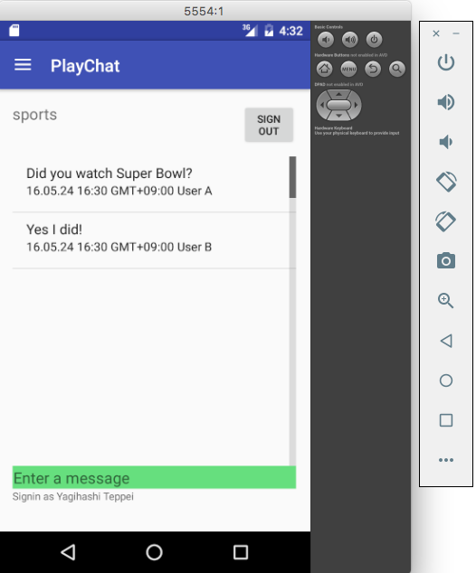

# Build a Mobile App Using  Firebase and App Engine Flexible Environment
This repository contains Android client sample code for "[Build a Mobile App Using  Firebase and App Engine Flexible Environment](https://cloud.google.com/solutions/mobile/mobile-firebase-appengine-flexible)" paper. Sample backend code can be found [here](https://github.com/GoogleCloudPlatform/firebase-appengine-backend).

## Build Requirements
Following Google APIs are needed to be enabled from Google Developers Console.
- Google App Engine
- Google Compute Engine
- Sign up on [Firebase](https://firebase.corp.google.com/) and create a new project (if you don't have one).

Firebase is a Google product, independent from Google Cloud Platform.

Build and test environment(verified)
- Android Studio 2.2 Preview 1
- Marshmallow API Level 23, x86_64, Android 6.0 (with Google APIs)
- UI layout is optimal for Nexus 5.

## Configuration

- Login to Firebase console and click "Add Firebase to your Android app".
- Follow instructions and make sure to place "google-services.json" file under "app" directory.
  - App name : PlayChat
  - Android package name : com.google.cloud.solutions.flexenv
  - Provide SHA-1 certificate fingerprint

## Launch and test
- Start a virtual device and run the app.
- Sign in with a Google account.
- Select a channel from top-left menu and enter messages.

## License
 Copyright 2016 Google Inc. All Rights Reserved.

 Licensed under the Apache License, Version 2.0 (the "License"); you may not use this file except in compliance with the License. You may obtain a copy of the License at
      http://www.apache.org/licenses/LICENSE-2.0
Unless required by applicable law or agreed to in writing, software distributed under the License is distributed on an "AS-IS" BASIS, WITHOUT WARRANTIES OR CONDITIONS OF ANY KIND, either express or implied.  See the License for the specific language governing permissions and limitations under the License.

This is not an official Google product.
